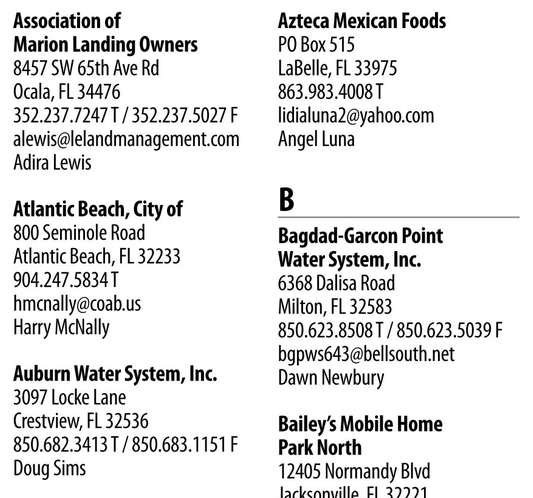
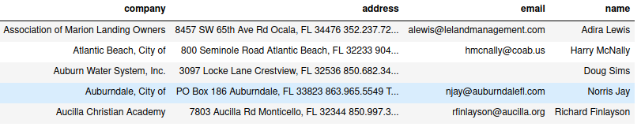

# Image to Text
Text extract &amp; reformatting for different text structure

## Installation

### Python Version

- Python == 3.8 (Any version of Python3 will work fine)

### Library Installation

#### Linux
- `sudo apt-get install tesseract-ocr`

## Tasks
1. Data extract from column wise structure [Link](multiple_column_in_one_page/column%20wise%20data%20extract.ipynb)
<table>
<tr align='center'>
<td></td></tr>
<tr align='center'>
<td></td>
</tr>
<table>

2. Text recognition & removing [Link](image_inpainting/image_inpaint.ipynb)
<table>
<tr align='center'>
<td></td>
<td></td>
</tr>
<table>
